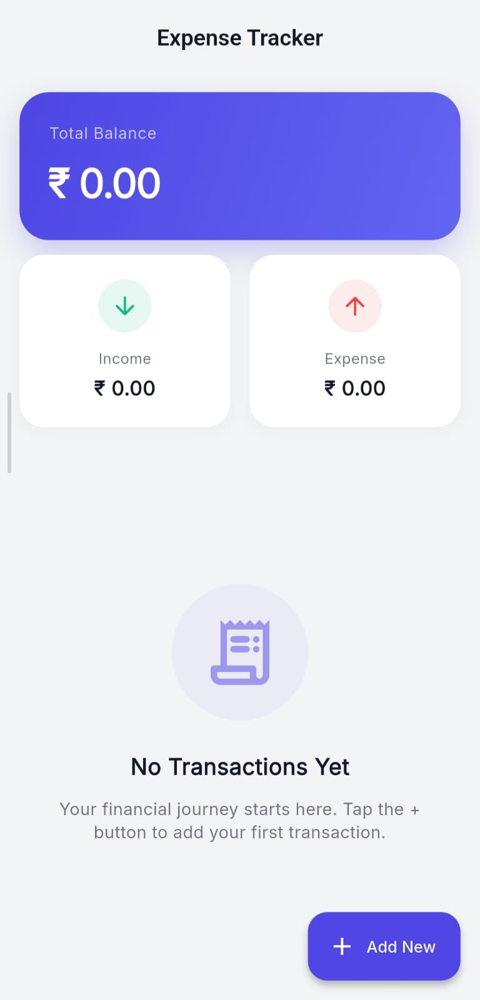
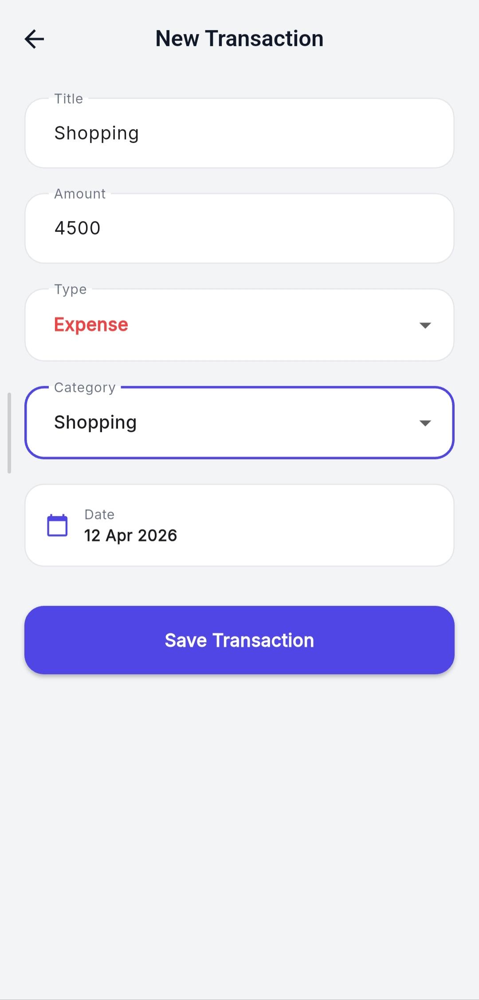
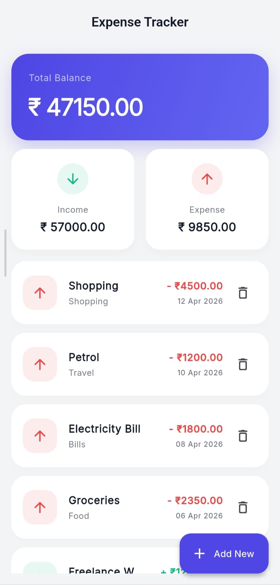

# Expense Tracker 💸

**Expense Tracker** is a modern Flutter application designed to help users manage daily income and expenses with ease. Built with clean architecture, smooth user experience, and local data persistence to demonstrate practical Flutter development skills.

---

## 🌟 Key Features

### 📊 Interactive Dashboard
- Real-time Total Balance overview
- Income and Expense summary cards
- Clean and modern financial dashboard

### ➕ Smart Transaction Management
- Add new Income / Expense transactions
- Select custom date using Date Picker
- Category-based organization
- Delete transactions instantly

### 💾 Secure Local Storage
- Built using Hive NoSQL database
- Fast offline access
- Auto-load saved data on app start

### ⚡ Live Auto Updates
- Balance updates instantly
- Income and Expense summaries refresh automatically
- Smooth reactive UI using Provider

### 🎨 Premium UI Experience
- Material 3 design system
- Clean typography
- Elegant cards and spacing
- User-friendly layout

---

## 🛠 Tech Stack

- **Framework:** Flutter
- **Language:** Dart
- **State Management:** Provider
- **Database:** Hive
- **Design:** Material 3 UI

---

## 📂 Project Structure

```text
lib/
├── core/
│   ├── services/
│   └── utils/
│
├── features/
│   └── expense_tracker/
│       ├── model/
│       ├── provider/
│       ├── screens/
│       └── widgets/
│
└── main.dart
```

---

## 📸 Screenshots

<p align="center">
  
  
  
</p>
---

## 💡 Highlights

This project demonstrates:

* Clean Flutter project structure
* State management using Provider
* Local database integration using Hive
* Reusable widget-based UI
* Practical real-world app development skills

---

## 👨‍💻 Developer

**Satyam Gawali**

Flutter Developer passionate about building clean and useful mobile applications.

---

## 🚀 Repository

Open-source Flutter project showcasing clean architecture and local storage implementation.

---

*Crafted with Flutter 💙*
